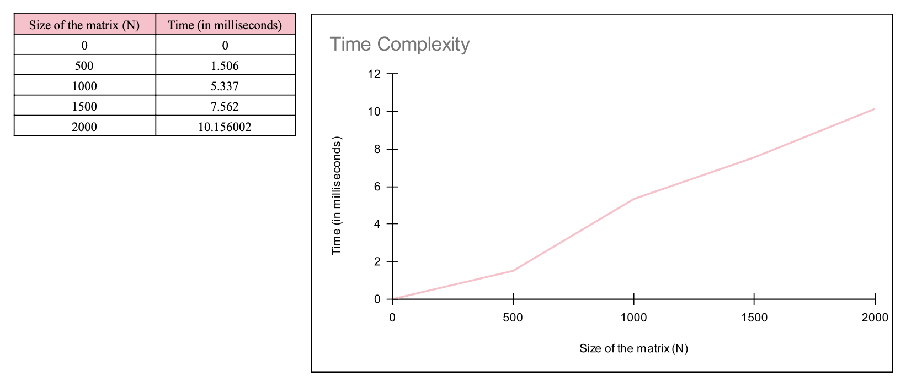
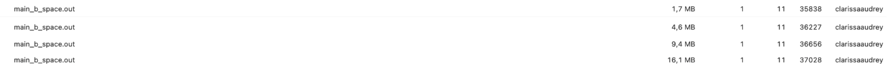
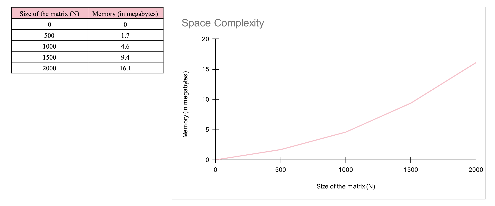

# Matrix-Vector Multiplication

This folder contains C sample codes to perform a matrix-vector multiplication.

## Running the Test

In this section, I will show how to run the program and its outputs.

Command to run the program (on macOS):
```
make; ./main.out
```

The output:
```
Test #1:
Actual V[0] = 0 ; Expected V[0] = 0 
Actual V[1] = 0 ; Expected V[1] = 0 

Test #2:
Actual V[0] = 11; Expected V[0] = 11
Actual V[1] = 7 ; Expected V[1] = 7 

Test #3:
Actual V[0] = 17; Expected V[0] = 17
Actual V[1] = 29; Expected V[1] = 29
```
The code is used to test out the function `multiply_vector_matrix()` that takes `Matrix, Vector, N, vector_expected` as its inputs. In this case, the matrix and vector inputs have been provided as the test cases, where I used three test cases along with `N = 2`. The output that came out generated by `multiply_vector_matrix()` function matches with the expected result (which was calculated manually). Thus, it can be considered that the function works correctly.

## Benchmark

This section analyzes the matrix-vector multiplication performance through its time and space complexity.

### Time Complexity

Command to run the program (on macOs):
```
make time; ./main_b_time.out
```

Output: 

```
Time elapsed: 210.596024 ms
```
In this case, the amount of time needed to calculate the multiplication of $N\times N$ Matrix to the $\mathbf{N}$-Vector having the size of `N = 10000` is `210.596024 ms`.

Below is the graph showing the amount of time needed (in milliseconds) as the size of the matrix (N) goes higher.



### Space Complexity

Command to run the program (on macOs):
```
make space; ./main_b_space.out
```

Output:

On Activity Monitor, there will be `main_b_space.out` running. 



I used four N respectively, `N = 500`, `N = 1000`, `N = 1500`, `N = 2000`. It can be seen from the image that as the size of the matrix (N) goes higher, the required amount of space will be larger.

Below is the graph showing the amount of memory needed (in megabytes) as the size of the matrix (N) goes higher.


